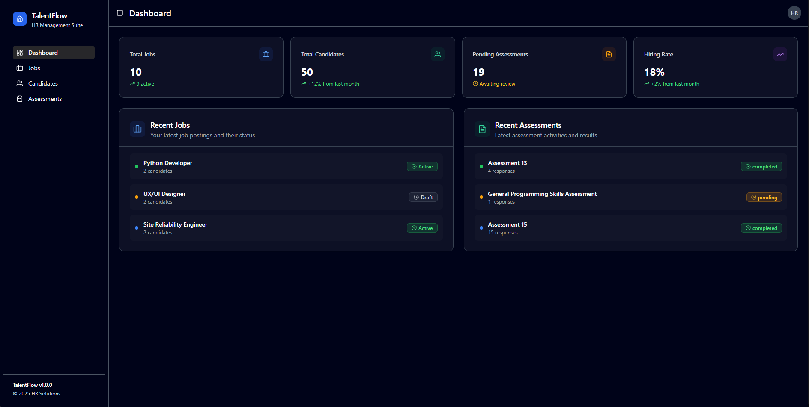

# TalentFlow - a Mini Hiring Platform

A comprehensive, modern hiring platform built with React, TypeScript, and cutting-edge web technologies. TalentFlow streamlines the entire recruitment process from job posting to candidate assessment and hiring decisions.

## 🚀 Live Demo

### **[View Live Application](https://talentflow-entnt.vercel.app/)**

---

## 📸 Application Screenshots

### Dashboard Overview

<div align="center">
  
  <br />
  <em>Main dashboard showing hiring pipeline overview and key metrics</em>
</div>

---

## �🎯 Requirements:

### ✅ **Core Flows Implemented**

#### **1. Jobs Board**

- ✅ **Pagination & Filtering**: Server-like pagination with title, status, and tags filtering
- ✅ **Create/Edit Modal**: Comprehensive job form with validation (title required, unique slug)
- ✅ **Archive/Unarchive**: Full lifecycle management with status transitions
- ✅ **Drag & Drop Reordering**: Optimistic updates with rollback on failure simulation
- ✅ **Deep Linking**: Direct navigation to `/jobs/:jobId` with full job details

#### **2. Candidates Management**

- ✅ **Virtualized List**: Handles 1000+ seeded candidates with smooth scrolling
- ✅ **Search & Filter**: Client-side search (name/email) + server-like stage filtering
- ✅ **Profile Routes**: Detailed `/candidates/:id` pages with complete timeline
- ✅ **Kanban Board**: Drag-and-drop stage management with visual pipeline
- ✅ **Notes with @Mentions**: Rich text notes with mention rendering and local suggestions

#### **3. Assessment System**

- ✅ **Assessment Builder**: Per-job builder with sections and multiple question types
- ✅ **Question Types**: Single-choice, multi-choice, short text, long text, numeric with range, file upload
- ✅ **Live Preview**: Real-time form rendering during assessment creation
- ✅ **Local Persistence**: Builder state and candidate responses stored locally
- ✅ **Form Runtime**: Full validation rules, conditional questions, and dynamic form behavior

### ✅ **API Simulation (MSW)**

All required endpoints implemented with realistic behavior:

```typescript
// Jobs API
GET    /api/jobs?search=&status=&page=&pageSize=&sort=
POST   /api/jobs
PATCH  /api/jobs/:id
PATCH  /api/jobs/:id/reorder  // Returns 500 occasionally for rollback testing

// Candidates API
GET    /api/candidates?search=&stage=&page=
POST   /api/candidates
PATCH  /api/candidates/:id
GET    /api/candidates/:id/timeline

// Assessments API
GET    /api/assessments/:jobId
PUT    /api/assessments/:jobId
POST   /api/assessments/:jobId/submit
```

### ✅ **Data Requirements Met**

- **🎲 Seed Data**: 25+ jobs (mixed active/archived), 1000+ candidates across all stages, 3+ comprehensive assessments
- **⏱️ Network Simulation**: 200-1200ms artificial latency on all requests
- **❌ Error Simulation**: 5-10% failure rate on write operations with proper error handling
- **💾 Local Persistence**: IndexedDB via Dexie for all data with write-through from MSW
- **🔄 State Restoration**: Complete application state restored from IndexedDB on page refresh

## 🌐 Live Demo

🚀 **[View Live Application](https://talentflow-entnt.vercel.app/)**

📁 **[GitHub Repository](https://github.com/nitianvinaypatel/talentflow)**

## 🚀 Features

### Core Functionality

- **Job Management**: Create, edit, and manage job postings with detailed requirements
- **Candidate Tracking**: Full candidate lifecycle management with stage-based workflow
- **Assessment Builder**: Dynamic form builder for creating custom technical and behavioral assessments
- **Real-time Dashboard**: Overview of hiring metrics and pipeline status
- **Timeline & Notes**: Comprehensive candidate interaction history and collaborative notes

### Assessment System

- **Dynamic Form Builder**: Create assessments with multiple question types
- **Question Types**: Single choice, multiple choice, text input, numeric, and file upload
- **Conditional Logic**: Show/hide questions based on previous responses
- **Real-time Validation**: Form validation with custom rules
- **Progress Tracking**: Visual progress indicators and section management
- **Draft Support**: Save and resume assessments

### Candidate Management

- **Pipeline Stages**: Applied → Screening → Technical → Offer → Hired/Rejected
- **Kanban Board**: Drag-and-drop candidate management
- **Advanced Filtering**: Search by name, email, stage, and job position
- **Profile Management**: Detailed candidate profiles with timeline
- **Assessment Results**: View and analyze candidate assessment responses
- **Collaboration**: Team notes with @mentions functionality

### User Experience

- **Dark/Light Theme**: System-aware theme switching
- **Responsive Design**: Mobile-first design that works on all devices
- **Performance Optimized**: Virtual scrolling for large datasets
- **Offline Support**: IndexedDB storage for offline functionality
- **Real-time Updates**: Optimistic updates with rollback support

## 🛠 Technology Stack

### Frontend

- **React 19** - Latest React with concurrent features
- **TypeScript** - Type-safe development with strict configuration
- **Vite** - Ultra-fast build tool with SWC compilation
- **Tailwind CSS** - Utility-first CSS framework with custom design system

### UI Components

- **Radix UI** - Headless, accessible components
- **Custom Component Library** - Tailored UI components with dark mode support
- **Lucide React** - Beautiful, customizable icons
- **Class Variance Authority** - Type-safe component variants

### State Management & Data

- **Zustand** - Lightweight state management with persistence
- **Dexie** - IndexedDB wrapper for client-side storage
- **MSW (Mock Service Worker)** - API mocking for development and testing
- **React Hook Form** - Performant form management
- **Zod** - Schema validation for type safety

### Development Tools

- **Vitest** - Fast unit testing framework
- **React Testing Library** - Component testing utilities
- **ESLint** - Code linting with React and TypeScript rules
- **Fake IndexedDB** - Database testing utilities

### Drag & Drop

- **@dnd-kit** - Modern drag-and-drop functionality for React

## 📁 Project Structure

```
src/
├── components/                 # Reusable UI components
│   ├── ui/                    # Base UI components (Button, Input, Modal, etc.)
│   │   ├── button.tsx
│   │   ├── input.tsx
│   │   ├── dialog.tsx
│   │   ├── table.tsx
│   │   └── ...
│   ├── layout/                # Layout components
│   │   ├── main-layout.tsx
│   │   ├── header.tsx
│   │   ├── sidebar.tsx
│   │   └── error-boundary.tsx
│   └── pages/                 # Page-level components
│       ├── dashboard.tsx
│       ├── not-found.tsx
│       └── ...
├── features/                  # Feature-specific modules
│   ├── jobs/                  # Job management
│   │   ├── components/
│   │   │   ├── job-card.tsx
│   │   │   ├── jobs-board.tsx
│   │   │   ├── job-form.tsx
│   │   │   └── ...
│   │   ├── hooks/
│   │   ├── types.ts
│   │   └── index.ts
│   ├── candidates/            # Candidate management
│   │   ├── components/
│   │   │   ├── candidate-card.tsx
│   │   │   ├── candidates-list.tsx
│   │   │   ├── candidate-profile.tsx
│   │   │   ├── candidates-kanban-view.tsx
│   │   │   ├── candidate-timeline.tsx
│   │   │   └── ...
│   │   ├── hooks/
│   │   │   ├── useCandidatesData.ts
│   │   │   └── useCandidatesFiltering.ts
│   │   ├── types.ts
│   │   └── index.ts
│   └── assessments/           # Assessment system
│       ├── components/
│       │   ├── assessment-builder.tsx
│       │   ├── section-manager.tsx
│       │   ├── question-editor.tsx
│       │   ├── assessment-preview.tsx
│       │   ├── form-fields/
│       │   │   ├── single-choice-field.tsx
│       │   │   ├── multi-choice-field.tsx
│       │   │   ├── text-field.tsx
│       │   │   └── ...
│       │   └── ...
│       ├── pages/
│       │   ├── assessment-builder-page.tsx
│       │   ├── assessments-list-page.tsx
│       │   └── ...
│       ├── services/
│       │   ├── response-service.ts
│       │   ├── validation-service.ts
│       │   └── ...
│       ├── types/
│       │   └── form.ts
│       ├── utils/
│       │   ├── form-validation.ts
│       │   ├── conditional-logic.ts
│       │   └── ...
│       └── index.ts
├── lib/                       # Core utilities and configurations
│   ├── api/                   # API layer
│   │   ├── client.ts
│   │   ├── handlers.ts        # MSW request handlers
│   │   └── setup.ts           # MSW configuration
│   ├── db/                    # Database layer
│   │   ├── schema.ts          # Dexie database schema
│   │   ├── operations.ts      # Database operations
│   │   ├── seed.ts           # Test data seeding
│   │   └── index.ts
│   ├── store/                 # State management
│   │   └── index.ts          # Zustand store
│   ├── router.tsx            # React Router configuration
│   ├── theme-context.tsx     # Theme management
│   └── utils.ts              # Utility functions
├── hooks/                     # Custom React hooks
│   ├── use-theme.tsx
│   ├── use-mobile.tsx
│   ├── useOptimisticUpdate.ts
│   ├── usePerformance.ts
│   └── ...
├── types/                     # TypeScript type definitions
│   └── index.ts              # Core application types
├── App.tsx                   # Root application component
├── main.tsx                  # Application entry point
└── index.css                # Global styles and CSS variables
```

## 🚦 Getting Started

### Prerequisites

- **Node.js** (v18 or higher)
- **npm** or **yarn**
- **Modern Browser** (Chrome 90+, Firefox 88+, Safari 14+, Edge 90+)

### Quick Start

1. **Clone the repository**

   ```bash
   git clone <https://github.com/nitianvinaypatel/talentflow.git>
   cd talentflow
   ```

2. **Install dependencies**

   ```bash
   npm install
   ```

3. **Start development server**

   ```bash
   npm run dev
   ```

4. **Open application**
   Navigate to `http://localhost:5173`

The application will automatically:

- 🔄 Initialize MSW for API simulation
- 🗄️ Seed IndexedDB with realistic test data
- 🎨 Apply system theme (dark/light mode)
- 📱 Enable responsive design for all screen sizes

### Available Scripts

| Command              | Description                         | Usage                  |
| -------------------- | ----------------------------------- | ---------------------- |
| `npm run dev`        | Development server with hot reload  | Primary development    |
| `npm run build`      | Production build with optimizations | Deployment preparation |
| `npm run preview`    | Preview production build locally    | Pre-deployment testing |
| `npm run test`       | Run test suite once                 | CI/CD integration      |
| `npm run test:watch` | Run tests in watch mode             | Development testing    |
| `npm run test:ui`    | Run tests with Vitest UI            | Interactive testing    |
| `npm run lint`       | ESLint code quality check           | Code review            |

### 🎮 Demo Features & Usage

#### **Jobs Management**

1. **Navigate to Jobs** (`/jobs`) - View paginated job listings
2. **Create New Job** - Click "Create Job" button, fill form with validation
3. **Edit Job** - Click edit icon on any job card
4. **Drag & Drop** - Reorder jobs by dragging job cards (test rollback with simulated failures)
5. **Filter & Search** - Use status dropdown and search by title/tags

#### **Candidates Pipeline**

1. **View Candidates** (`/candidates`) - Virtualized list with 1000+ entries
2. **Search Functionality** - Real-time search by name or email
3. **Stage Filtering** - Filter by current candidate stage
4. **Kanban View** - Drag candidates between pipeline stages
5. **Candidate Profile** - Click any candidate to view detailed profile with timeline

#### **Assessment Builder**

1. **Create Assessment** (`/assessments`) - Choose job-specific or standalone
2. **Add Sections** - Organize questions into logical sections
3. **Question Types** - Add various question types with different validation rules
4. **Conditional Logic** - Set up questions that appear based on previous answers
5. **Live Preview** - See real-time form preview while building
6. **Test Assessment** - Complete assessments as a candidate would

## 📊 Core Entities & Data Models

### Job

```typescript
interface Job {
  id: string;
  title: string;
  slug: string;
  description: string;
  status: "active" | "archived";
  tags: string[];
  order: number;
  requirements: string[];
  location: string;
  type: "full-time" | "part-time" | "contract";
  createdAt: Date;
  updatedAt: Date;
}
```

### Candidate

```typescript
interface Candidate {
  id: string;
  name: string;
  email: string;
  phone?: string;
  resume?: string;
  stage: "applied" | "screen" | "tech" | "offer" | "hired" | "rejected";
  jobId: string;
  appliedAt: Date;
  updatedAt: Date;
  notes: Note[];
  assessmentResponses: AssessmentResponse[];
  timeline: TimelineEvent[];
}
```

### Assessment

```typescript
interface Assessment {
  id: string;
  jobId?: string; // Optional for standalone assessments
  title: string;
  description: string;
  sections: AssessmentSection[];
  createdAt: Date;
  updatedAt: Date;
}
```

### Question Types

The assessment system supports multiple question types:

- **Single Choice**: Radio button selection
- **Multiple Choice**: Checkbox selection
- **Short Text**: Single-line text input
- **Long Text**: Multi-line textarea
- **Numeric**: Number input with validation
- **File Upload**: File attachment with type/size restrictions

## 🎨 Design System

### Theme Support

- **Light/Dark Mode**: Automatic system detection with manual override
- **CSS Variables**: Consistent color system with semantic naming
- **Responsive Design**: Mobile-first approach with breakpoint utilities

### Color Palette

- **Primary**: Blue-based accent colors
- **Secondary**: Gray-based neutral colors
- **Success**: Green for positive actions
- **Warning**: Amber for cautionary states
- **Error**: Red for error states
- **Info**: Blue for informational content

### Component Variants

Most components support multiple variants:

- **Size**: sm, md, lg, xl
- **Variant**: default, outline, ghost, destructive
- **State**: disabled, loading, error

## 🗄 Database Schema

The application uses **Dexie** (IndexedDB) for client-side storage:

```typescript
// Database tables
jobs: "++id, title, status, order, createdAt, slug";
candidates: "++id, name, email, stage, jobId, appliedAt";
assessments: "++id, jobId, title, createdAt";
candidateTimeline: "++id, candidateId, timestamp, type";
assessmentResponses: "++id, candidateId, assessmentId, submittedAt, status";
```

### Automatic Timestamps

- **Creating**: Automatically sets `createdAt` and `updatedAt`
- **Updating**: Automatically updates `updatedAt`

## 🏗️ Technical Architecture

### 🎯 **Assignment-Specific Implementation**

#### **Network Simulation Layer**

```typescript
// MSW handlers with realistic network conditions
function withNetworkSimulation(handler: Function, isWriteOperation = false) {
  return async (...args: any[]) => {
    // Simulate latency: 200-1200ms
    await sleep(Math.random() * 1000 + 200);

    // Simulate 5-10% error rate on writes
    if (isWriteOperation && Math.random() < 0.075) {
      throw new Error("Simulated network error");
    }

    return handler(...args);
  };
}
```

#### **Optimistic Updates with Rollback**

```typescript
// Example: Job reordering with failure simulation
const reorderJobs = async (fromIndex: number, toIndex: number) => {
  // Optimistic UI update
  const optimisticUpdate = updateUIImmediately(fromIndex, toIndex);

  try {
    await api.jobs.reorder(fromIndex, toIndex);
    confirmUpdate(optimisticUpdate);
  } catch (error) {
    // Rollback on failure
    rollbackUpdate(optimisticUpdate);
    showErrorMessage("Reorder failed. Changes have been reverted.");
  }
};
```

#### **Data Persistence Strategy**

```typescript
// Write-through caching: MSW → IndexedDB
export const handlers = [
  http.post("/api/jobs", async ({ request }) => {
    const jobData = await request.json();

    // Validate and save to IndexedDB
    const savedJob = await JobsService.create(jobData);

    // Return response (simulating server)
    return HttpResponse.json({ data: savedJob, success: true });
  }),
];
```

### 🗄️ **Database Design (IndexedDB via Dexie)**

```typescript
export class TalentFlowDB extends Dexie {
  jobs!: Table<Job>;
  candidates!: Table<Candidate>;
  assessments!: Table<Assessment>;
  candidateTimeline!: Table<TimelineEvent>;
  assessmentResponses!: Table<AssessmentResponse>;

  constructor() {
    super("TalentFlowDB");

    this.version(1).stores({
      jobs: "++id, title, status, order, createdAt, slug",
      candidates: "++id, name, email, stage, jobId, appliedAt",
      assessments: "++id, jobId, title, createdAt",
      candidateTimeline: "++id, candidateId, timestamp, type",
      assessmentResponses:
        "++id, candidateId, assessmentId, submittedAt, status",
    });
  }
}
```

### 🔄 **State Management Architecture**

```typescript
// Zustand store with persistence and optimistic updates
interface AppStore {
  // Core Data
  jobs: Job[];
  candidates: Candidate[];
  assessments: Assessment[];

  // UI State
  loading: LoadingState;
  errors: ErrorState;

  // Optimistic Updates
  pendingUpdates: OptimisticUpdate<any>[];

  // Actions with error handling and rollback
  updateJob: (id: string, updates: Partial<Job>) => Promise<void>;
  reorderJobs: (fromIndex: number, toIndex: number) => Promise<void>;

  // Persistence
  syncWithAPI: () => Promise<void>;
  loadFromStorage: () => Promise<void>;
}
```

### 🎨 **Component Architecture**

#### **Feature-Based Organization**

```
features/
├── jobs/
│   ├── components/     # UI components
│   ├── hooks/         # Business logic hooks
│   ├── services/      # Data operations
│   ├── types.ts       # Feature-specific types
│   └── utils/         # Helper functions
```

#### **Reusable UI System**

```typescript
// Example: Polymorphic button component
interface ButtonProps<T extends ElementType = "button"> {
  as?: T;
  variant?: "default" | "outline" | "ghost" | "destructive";
  size?: "sm" | "md" | "lg";
  loading?: boolean;
}

export const Button = <T extends ElementType = "button">({
  as,
  variant = "default",
  size = "md",
  loading = false,
  ...props
}: ButtonProps<T>) => {
  // Implementation with proper TypeScript inference
};
```

## 🧪 Testing Strategy

### Test Infrastructure

The application includes a comprehensive testing setup designed for reliability and maintainability:

#### **Testing Stack**

- **Vitest**: Fast test runner with excellent TypeScript support
- **React Testing Library**: Component testing focused on user behavior
- **MSW**: API mocking for realistic integration tests
- **Fake IndexedDB**: In-memory database for testing persistence
- **User Event**: Realistic user interaction simulation

#### **Test Categories**

**1. Unit Tests**

```typescript
// Example: Utility function testing
describe("formatCandidateName", () => {
  it("should format full name correctly", () => {
    expect(formatCandidateName("john", "doe")).toBe("John Doe");
  });

  it("should handle single name", () => {
    expect(formatCandidateName("john")).toBe("John");
  });
});
```

**2. Component Tests**

```typescript
// Example: Component integration testing
describe("JobCard", () => {
  it("should handle job editing workflow", async () => {
    const mockJob = createMockJob();
    const onEdit = vi.fn();

    render(<JobCard job={mockJob} onEdit={onEdit} />);

    await user.click(screen.getByRole("button", { name: /edit/i }));
    expect(onEdit).toHaveBeenCalledWith(mockJob);
  });
});
```

**3. Integration Tests**

```typescript
// Example: Feature workflow testing
describe("Candidate Pipeline", () => {
  it("should move candidate through stages", async () => {
    const candidate = await createTestCandidate();

    render(<CandidatesKanbanView />);

    // Drag candidate from 'applied' to 'screen'
    await dragCandidateToStage(candidate.id, "screen");

    // Verify API call and UI update
    expect(mockUpdateCandidate).toHaveBeenCalledWith(candidate.id, {
      stage: "screen",
    });
  });
});
```

#### **Mock Data Generation**

```typescript
// Realistic test data factories
const createMockJob = (overrides?: Partial<Job>): Job => ({
  id: nanoid(),
  title: faker.person.jobTitle(),
  slug: faker.helpers.slugify(faker.person.jobTitle()),
  description: faker.lorem.paragraphs(2),
  status: faker.helpers.arrayElement(["active", "archived"]),
  tags: faker.helpers.arrayElements(["react", "typescript", "remote"], 2),
  order: faker.number.int({ min: 0, max: 100 }),
  requirements: faker.helpers.arrayElements(
    [
      "Bachelor's degree in Computer Science",
      "3+ years React experience",
      "TypeScript proficiency",
    ],
    3
  ),
  location: faker.location.city(),
  type: faker.helpers.arrayElement(["full-time", "part-time", "contract"]),
  createdAt: faker.date.recent(),
  updatedAt: faker.date.recent(),
  ...overrides,
});
```

### Continuous Integration

```yaml
# .github/workflows/test.yml
name: Test Suite
on: [push, pull_request]

jobs:
  test:
    runs-on: ubuntu-latest
    steps:
      - uses: actions/checkout@v4
      - uses: actions/setup-node@v4
        with:
          node-version: "18"
          cache: "npm"

      - run: npm ci
      - run: npm run lint
      - run: npm run test
      - run: npm run build
```

## 🚀 Deployment & Production

### Build Configuration

```typescript
// vite.config.ts - Optimized production build
export default defineConfig({
  plugins: [react()],
  build: {
    rollupOptions: {
      output: {
        manualChunks: {
          vendor: ["react", "react-dom"],
          ui: ["@radix-ui/react-dialog", "@radix-ui/react-dropdown-menu"],
          utils: ["date-fns", "nanoid", "clsx"],
        },
      },
    },
    chunkSizeWarningLimit: 1000,
  },
  resolve: {
    alias: {
      "@": path.resolve(__dirname, "./src"),
    },
  },
});
```

### Deployment Options

#### **Vercel (Recommended)**

```bash
# Simple deployment
npm run build
npx vercel --prod
```

#### **Netlify**

```bash
# Build command: npm run build
# Publish directory: dist
# Environment variables: None required (frontend-only)
```

#### **Traditional Hosting**

```bash
npm run build
# Upload dist/ folder to your hosting provider
```

### Environment Configuration

```typescript
// Environment-aware configuration
const config = {
  development: {
    apiDelay: { min: 200, max: 1200 },
    errorRate: 0.075,
    enableMSW: true,
    enableDevTools: true,
  },
  production: {
    apiDelay: { min: 0, max: 0 },
    errorRate: 0,
    enableMSW: false,
    enableDevTools: false,
  },
};
```

### Performance Monitoring

```typescript
// Web Vitals tracking
import { getCLS, getFID, getFCP, getLCP, getTTFB } from "web-vitals";

function sendToAnalytics(metric: any) {
  // Send to your analytics service
  console.log(metric);
}

getCLS(sendToAnalytics);
getFID(sendToAnalytics);
getFCP(sendToAnalytics);
getLCP(sendToAnalytics);
getTTFB(sendToAnalytics);
```

## � Development Guide

### Code Organization Principles

#### **Feature-First Architecture**

```
src/features/jobs/
├── components/           # UI components specific to jobs
│   ├── job-card.tsx     # Reusable job display component
│   ├── job-form.tsx     # Job creation/editing form
│   └── jobs-board.tsx   # Main jobs listing page
├── hooks/               # Jobs-specific business logic
│   ├── use-job-form.ts  # Form validation and submission
│   └── use-jobs-data.ts # Data fetching and caching
├── services/            # Data layer operations
│   └── jobs-service.ts  # CRUD operations for jobs
├── types.ts             # Feature-specific TypeScript types
└── utils/               # Helper functions
    └── job-utils.ts     # Job-specific utilities
```

#### **Component Design Patterns**

**1. Compound Components**

```typescript
// Example: Flexible card component system
const JobCard = ({ children, ...props }) => <Card {...props}>{children}</Card>;

JobCard.Header = ({ title, status }) => (
  <CardHeader>
    <CardTitle>{title}</CardTitle>
    <Badge variant={status === "active" ? "default" : "secondary"}>
      {status}
    </Badge>
  </CardHeader>
);

JobCard.Content = CardContent;
JobCard.Footer = CardFooter;

// Usage
<JobCard>
  <JobCard.Header title="Frontend Developer" status="active" />
  <JobCard.Content>Job description...</JobCard.Content>
  <JobCard.Footer>Actions...</JobCard.Footer>
</JobCard>;
```

**2. Custom Hooks Pattern**

```typescript
// Encapsulate complex logic in reusable hooks
const useOptimisticJobUpdate = () => {
  const [jobs, setJobs] = useAppStore((state) => [state.jobs, state.setJobs]);

  const updateJob = useCallback(
    async (id: string, updates: Partial<Job>) => {
      // Optimistic update
      const optimisticJobs = jobs.map((job) =>
        job.id === id ? { ...job, ...updates } : job
      );
      setJobs(optimisticJobs);

      try {
        await api.jobs.update(id, updates);
      } catch (error) {
        // Rollback on failure
        setJobs(jobs);
        throw error;
      }
    },
    [jobs, setJobs]
  );

  return { updateJob };
};
```

### API Design Patterns

#### **Consistent Response Format**

```typescript
// Standardized API response structure
interface ApiResponse<T> {
  data: T;
  success: boolean;
  message?: string;
  pagination?: {
    page: number;
    pageSize: number;
    total: number;
    totalPages: number;
  };
}
```

#### **Error Handling Strategy**

```typescript
// Centralized error handling with user-friendly messages
const apiClient = {
  async request<T>(endpoint: string, options?: RequestInit): Promise<T> {
    try {
      const response = await fetch(endpoint, options);

      if (!response.ok) {
        throw new ApiError(response.status, await response.text());
      }

      return response.json();
    } catch (error) {
      if (error instanceof ApiError) {
        throw error;
      }

      // Network or other errors
      throw new ApiError(0, "Network error occurred");
    }
  },
};
```

### Styling Conventions

#### **Tailwind CSS Guidelines**

```typescript
// Consistent spacing and sizing
const spacing = {
  xs: "p-2", // 8px
  sm: "p-3", // 12px
  md: "p-4", // 16px
  lg: "p-6", // 24px
  xl: "p-8", // 32px
};

// Color-coded component states
const buttonVariants = {
  default: "bg-primary text-primary-foreground hover:bg-primary/90",
  destructive:
    "bg-destructive text-destructive-foreground hover:bg-destructive/90",
  outline: "border border-input bg-background hover:bg-accent",
  ghost: "hover:bg-accent hover:text-accent-foreground",
};
```

#### **Component Composition**

```typescript
// Build complex UIs from simple, reusable components
const CandidateCard = ({ candidate }: { candidate: Candidate }) => (
  <Card className="hover:shadow-md transition-shadow">
    <CardHeader className="pb-3">
      <div className="flex items-center justify-between">
        <CardTitle className="text-lg">{candidate.name}</CardTitle>
        <Badge variant={getStageVariant(candidate.stage)}>
          {candidate.stage}
        </Badge>
      </div>
      <CardDescription>{candidate.email}</CardDescription>
    </CardHeader>
    <CardContent>
      <div className="space-y-2">
        <div className="flex items-center text-sm text-muted-foreground">
          <Calendar className="mr-2 h-4 w-4" />
          Applied {formatDate(candidate.appliedAt)}
        </div>
        <div className="flex items-center text-sm text-muted-foreground">
          <Building className="mr-2 h-4 w-4" />
          {candidate.jobTitle}
        </div>
      </div>
    </CardContent>
  </Card>
);
```

## 🎯 Key Features Deep Dive

### 🏢 **Jobs Management System**

#### **Advanced Job Board**

- **Smart Pagination**: Server-style pagination with configurable page sizes
- **Multi-Filter System**: Combine search, status, and tag filters
- **Drag & Drop Reordering**: Visual job prioritization with persistence
- **Unique Slug Validation**: Automatic URL-friendly slug generation with conflict detection
- **Bulk Operations**: Archive/activate multiple jobs simultaneously

```typescript
// Example: Advanced filtering implementation
const useJobsFiltering = (jobs: Job[], filters: JobFilters) => {
  return useMemo(() => {
    return jobs.filter((job) => {
      const matchesSearch =
        !filters.search ||
        job.title.toLowerCase().includes(filters.search.toLowerCase()) ||
        job.tags.some((tag) =>
          tag.toLowerCase().includes(filters.search.toLowerCase())
        );

      const matchesStatus =
        filters.status === "all" || job.status === filters.status;
      const matchesTags =
        !filters.tags.length ||
        filters.tags.every((tag) => job.tags.includes(tag));

      return matchesSearch && matchesStatus && matchesTags;
    });
  }, [jobs, filters]);
};
```

### 👥 **Candidate Pipeline Management**

#### **Virtualized Performance**

- **1000+ Candidates**: Smooth scrolling with react-virtuoso
- **Real-time Search**: Debounced search across name/email fields
- **Stage-based Filtering**: Quick access to candidates at specific pipeline stages
- **Batch Stage Updates**: Move multiple candidates simultaneously

#### **Kanban Board Features**

```typescript
// Drag and drop implementation with stage validation
const handleCandidateDrop = (candidateId: string, newStage: CandidateStage) => {
  const candidate = candidates.find((c) => c.id === candidateId);

  // Validate stage transition
  if (!isValidStageTransition(candidate.stage, newStage)) {
    toast.error("Invalid stage transition");
    return;
  }

  // Optimistic update with rollback
  updateCandidateStage(candidateId, newStage);
};
```

#### **Rich Timeline System**

- **Event Types**: Application, stage changes, notes, assessments, interviews
- **Automatic Tracking**: System-generated events for all candidate interactions
- **Manual Entries**: HR team can add custom timeline events
- **Collaborative Notes**: @mention system with notification rendering

### 📋 **Assessment Builder System**

#### **Dynamic Form Builder**

- **Section Management**: Drag-and-drop section reordering
- **Question Types**: 6 distinct question types with type-specific validation
- **Conditional Logic Engine**: Show/hide questions based on previous responses
- **Real-time Preview**: Live form rendering as you build

```typescript
// Conditional logic evaluation
const evaluateConditionalLogic = (
  question: Question,
  responses: Record<string, any>
): boolean => {
  if (!question.conditionalLogic?.length) return true;

  return question.conditionalLogic.every((rule) => {
    const dependentValue = responses[rule.dependsOnQuestionId];

    switch (rule.condition) {
      case "equals":
        return dependentValue === rule.value;
      case "contains":
        return (
          Array.isArray(dependentValue) && dependentValue.includes(rule.value)
        );
      // Additional conditions...
    }
  });
};
```

#### **Advanced Validation System**

```typescript
// Multi-layered validation
const questionValidators = {
  required: (value: any, question: Question) =>
    question.required && (!value || value === "")
      ? "This field is required"
      : null,

  numericRange: (value: number, rule: ValidationRule) => {
    const { min, max } = rule.value;
    if (value < min || value > max) {
      return `Value must be between ${min} and ${max}`;
    }
    return null;
  },

  maxLength: (value: string, rule: ValidationRule) =>
    value.length > rule.value
      ? `Maximum ${rule.value} characters allowed`
      : null,
};
```

### 🎨 **UI/UX Excellence**

#### **Theme System**

- **System Detection**: Automatic dark/light mode based on OS preference
- **Manual Override**: User can force specific theme with persistence
- **CSS Custom Properties**: Semantic color system for consistent theming
- **Component Variants**: All components support theme-aware styling

#### **Responsive Design**

```css
/* Mobile-first breakpoint system */
.responsive-grid {
  display: grid;
  grid-template-columns: 1fr;
  gap: 1rem;

  @media (min-width: 768px) {
    grid-template-columns: repeat(2, 1fr);
  }

  @media (min-width: 1024px) {
    grid-template-columns: repeat(3, 1fr);
  }
}
```

#### **Performance Optimizations**

- **Virtual Scrolling**: Handle thousands of items without performance degradation
- **Code Splitting**: Route-based lazy loading for faster initial loads
- **Memoization**: Strategic use of useMemo and React.memo
- **Bundle Analysis**: Optimized bundle size with tree shaking

### 🔒 **Error Handling & Resilience**

#### **Comprehensive Error Boundaries**

```typescript
class FeatureErrorBoundary extends Component<Props, State> {
  static getDerivedStateFromError(error: Error): State {
    return { hasError: true, error };
  }

  componentDidCatch(error: Error, errorInfo: ErrorInfo) {
    // Log error to monitoring service
    console.error("Feature error:", error, errorInfo);
  }

  render() {
    if (this.state.hasError) {
      return (
        <ErrorFallback onReset={() => this.setState({ hasError: false })} />
      );
    }

    return this.props.children;
  }
}
```

#### **Network Resilience**

- **Retry Logic**: Automatic retry for failed requests with exponential backoff
- **Offline Support**: Queue actions when offline, sync when reconnected
- **Error Recovery**: User-friendly error messages with recovery actions
- **Optimistic Updates**: Immediate feedback with rollback capabilities

## � Technical Decisions & Trade-offs

### Architecture Decisions

#### **Frontend-Only with MSW**

**Decision**: Use Mock Service Worker instead of a real backend
**Rationale**:

- Enables rapid prototyping and development
- Realistic API behavior simulation
- Zero deployment complexity
- Perfect for technical demonstrations

**Trade-offs**:

- ✅ Faster development cycle
- ✅ No server infrastructure required
- ✅ Consistent API behavior across environments
- ⚠️ Limited to client-side persistence
- ⚠️ No real-time collaboration features

#### **IndexedDB for Persistence**

**Decision**: Use Dexie.js wrapper around IndexedDB
**Rationale**:

- Browser-native persistence
- Works offline
- Handles large datasets efficiently
- Transactional support

**Trade-offs**:

- ✅ No external dependencies
- ✅ Excellent performance for large datasets
- ✅ Works in all modern browsers
- ⚠️ More complex than localStorage
- ⚠️ Browser-specific data (not shareable)

#### **Zustand for State Management**

**Decision**: Zustand over Redux Toolkit or Context API
**Rationale**:

- Minimal boilerplate
- TypeScript-first design
- Built-in persistence
- Excellent DevTools

**Comparison**:

```typescript
// Zustand (chosen)
const useStore = create((set, get) => ({
  jobs: [],
  updateJob: (id, updates) =>
    set((state) => ({
      jobs: state.jobs.map((job) =>
        job.id === id ? { ...job, ...updates } : job
      ),
    })),
}));

// Redux Toolkit (alternative)
const jobsSlice = createSlice({
  name: "jobs",
  initialState: { jobs: [] },
  reducers: {
    updateJob: (state, action) => {
      const index = state.jobs.findIndex((job) => job.id === action.payload.id);
      if (index !== -1) {
        state.jobs[index] = { ...state.jobs[index], ...action.payload.updates };
      }
    },
  },
});
```

#### **Vite over Create React App**

**Decision**: Vite for build tooling
**Rationale**:

- Significantly faster development server
- Modern ES modules support
- Better TypeScript integration
- Smaller, more flexible configuration

**Performance Comparison**:

- **Cold Start**: Vite ~100ms vs CRA ~3000ms
- **Hot Reload**: Vite ~50ms vs CRA ~300ms
- **Build Time**: Vite ~15s vs CRA ~45s (for this project size)

### Performance Optimizations

#### **Virtual Scrolling Implementation**

```typescript
// Handles 1000+ candidates without performance issues
import { Virtuoso } from "react-virtuoso";

const VirtualizedCandidatesList = ({ candidates }: Props) => (
  <Virtuoso
    data={candidates}
    itemContent={(index, candidate) => (
      <CandidateCard
        key={candidate.id}
        candidate={candidate}
        onClick={() => navigate(`/candidates/${candidate.id}`)}
      />
    )}
    style={{ height: "600px" }}
    overscan={5}
  />
);
```

#### **Optimistic Updates Strategy**

```typescript
// Immediate UI feedback with rollback capability
const useOptimisticUpdate = <T>(
  items: T[],
  updateFn: (items: T[]) => Promise<T[]>,
  getId: (item: T) => string
) => {
  const [optimisticItems, setOptimisticItems] = useState(items);

  const performUpdate = async (updateCallback: (items: T[]) => T[]) => {
    // Apply optimistic update
    const newItems = updateCallback(items);
    setOptimisticItems(newItems);

    try {
      // Attempt server update
      const serverItems = await updateFn(newItems);
      setOptimisticItems(serverItems);
    } catch (error) {
      // Rollback on failure
      setOptimisticItems(items);
      throw error;
    }
  };

  return { optimisticItems, performUpdate };
};
```

#### **Bundle Optimization**

```typescript
// Code splitting by route and feature
const JobsBoard = lazy(() => import("../features/jobs/components/jobs-board"));
const CandidatesList = lazy(
  () => import("../features/candidates/components/candidates-list")
);
const AssessmentBuilder = lazy(
  () => import("../features/assessments/components/assessment-builder")
);

// Dynamic imports for heavy dependencies
const importChartLibrary = () =>
  import("chart.js").then((module) => module.default);
```

### Security Considerations

#### **Input Validation & Sanitization**

```typescript
// Zod schemas for runtime validation
const jobFormSchema = z.object({
  title: z.string().min(1, "Title is required").max(100, "Title too long"),
  slug: z.string().regex(/^[a-z0-9-]+$/, "Invalid slug format"),
  description: z.string().min(10, "Description too short"),
  tags: z.array(z.string()).max(10, "Too many tags"),
});

// XSS protection for user content
const sanitizeUserInput = (input: string): string => {
  return DOMPurify.sanitize(input, {
    ALLOWED_TAGS: ["b", "i", "em", "strong"],
    ALLOWED_ATTR: [],
  });
};
```
